# Sistema de Control de Inventario

> **Sistema de gestión de inventarios con persistencia automática, control de ventas y reportes**


## Tabla de Contenidos

- [Descripción](#descripción)
- [Características](#características)
- [Estructura del Proyecto](#estructura-del-proyecto)
- [Instalación](#instalación)
- [Uso](#uso)
- [Arquitectura](#arquitectura)
- [Diagramas de Flujo](#diagramas-de-flujo)
- [Persistencia de Datos](#persistencia-de-datos)
- [Ejemplos de Uso](#ejemplos-de-uso)


### Menú Principal

```
=== MENÚ PRINCIPAL ===
1. Productos
2. Ventas y Reportes
3. Datos y Persistencia
4. Todas las opciones
0. Salir
```

### Navegación por Submenús

#### Submenú: Productos
```
1. Agregar producto
2. Listar productos
3. Buscar producto
4. Actualizar cantidad
5. Eliminar producto
6. Filtrar por categoría
7. Filtrar por rango de precio
8. Verificar estado del stock
9. Calcular valor total
13. Gráfica de inventario
0. Volver
```

#### Submenú: Ventas y Reportes
```
10. Registrar venta
11. Productos más vendidos
12. Reporte de ventas
0. Volver
```

#### Submenú: Datos y Persistencia
```
14. Guardar datos (manual)
15. Cargar datos (manual)
16. Salir
0. Volver
```

---

## Diagrama de flujo

### Diagrama de Clases

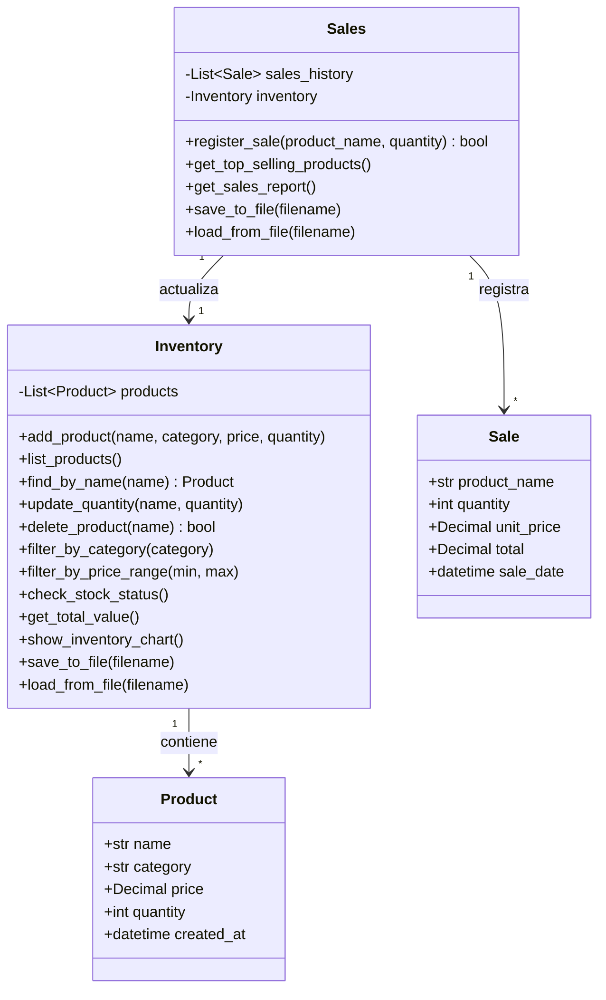
```mermaid
classDiagram
    class Product {
        +str name
        +str category
        +Decimal price
        +int quantity
        +datetime created_at
    }
    
    class Inventory {
        -List~Product~ products
        +add_product(name, category, price, quantity)
        +list_products()
        +find_by_name(name) Product
        +update_quantity(name, quantity)
        +delete_product(name) bool
        +filter_by_category(category)
        +filter_by_price_range(min, max)
        +check_stock_status()
        +get_total_value()
        +show_inventory_chart()
        +save_to_file(filename)
        +load_from_file(filename)
    }
    
    class Sale {
        +str product_name
        +int quantity
        +Decimal unit_price
        +Decimal total
        +datetime sale_date
    }
    
    class Sales {
        -List~Sale~ sales_history
        -Inventory inventory
        +register_sale(product_name, quantity) bool
        +get_top_selling_products()
        +get_sales_report()
        +save_to_file(filename)
        +load_from_file(filename)
    }
    
    Inventory "1" --> "*" Product : contiene
    Sales "1" --> "*" Sale : registra
    Sales "1" --> "1" Inventory : actualiza
```

### Principios de Diseño

- **SRP (Single Responsibility Principle)**: Cada clase tiene una única responsabilidad
- **Separación de Concerns**: Productos, ventas y persistencia en módulos separados
- **DRY (Don't Repeat Yourself)**: Función central `handle_option()` para todas las operaciones
- **Validación robusta**: `try/except` en puntos críticos de entrada de datos

---

## Diagramas de Flujo

### 1. Flujo Principal del Sistema

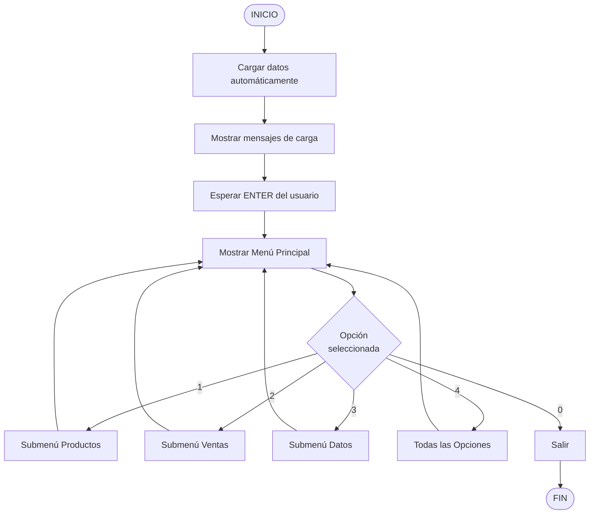
```mermaid
flowchart TD
    Start([INICIO]) --> Load[Cargar datos automáticamente]
    Load --> ShowMsg[Mostrar mensajes de carga]
    ShowMsg --> Wait[Esperar ENTER del usuario]
    Wait --> Menu[Mostrar Menú Principal]
    
    Menu --> Input{Opción<br/>seleccionada}
    
    Input -->|"1"| SubProducts[Submenú Productos]
    Input -->|"2"| SubSales[Submenú Ventas]
    Input -->|"3"| SubData[Submenú Datos]
    Input -->|"4"| AllOptions[Todas las Opciones]
    Input -->|"0"| Exit[Salir]
    
    SubProducts --> Menu
    SubSales --> Menu
    SubData --> Menu
    AllOptions --> Menu
    
    Exit --> End([FIN])
```

### 2. Agregar Producto

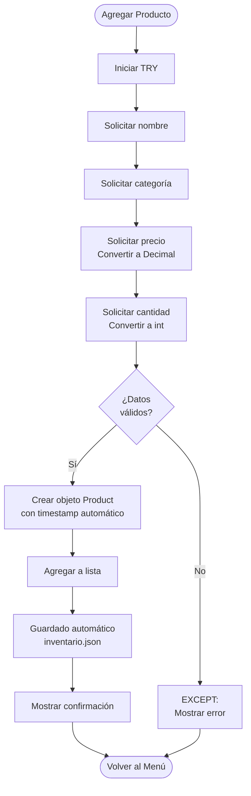
```mermaid
flowchart TD
    Start([Agregar Producto]) --> TryStart[Iniciar TRY]
    TryStart --> Name[Solicitar nombre]
    Name --> Cat[Solicitar categoría]
    Cat --> Price[Solicitar precio<br/>Convertir a Decimal]
    Price --> Qty[Solicitar cantidad<br/>Convertir a int]
    
    Qty --> Valid{¿Datos<br/>válidos?}
    
    Valid -->|Sí| Create[Crear objeto Product<br/>con timestamp automático]
    Create --> Add[Agregar a lista]
    Add --> AutoSave[Guardado automático<br/>inventario.json]
    AutoSave --> Success[Mostrar confirmación]
    Success --> Return([Volver al Menú])
    
    Valid -->|No| Error[EXCEPT:<br/>Mostrar error]
    Error --> Return
```

### 3. Listar Productos

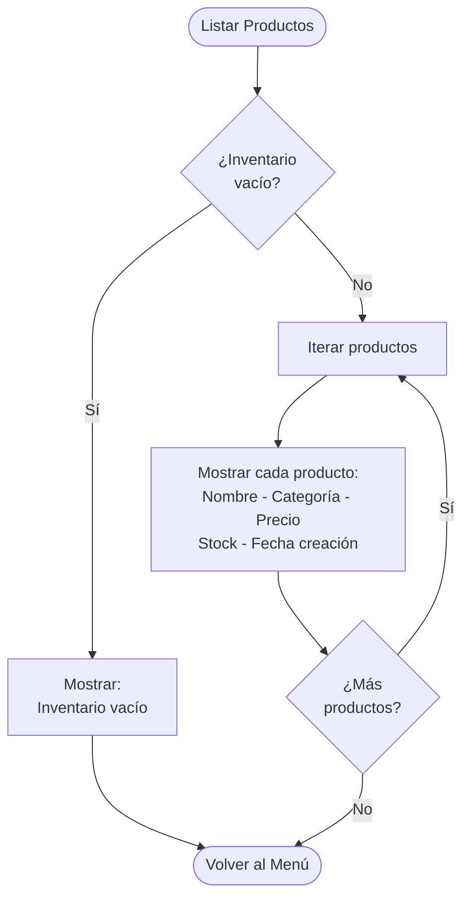
```mermaid
flowchart TD
    Start([Listar Productos]) --> Check{¿Inventario<br/>vacío?}
    
    Check -->|Sí| Empty[Mostrar:<br/>Inventario vacío]
    Empty --> Return([Volver al Menú])
    
    Check -->|No| Loop[Iterar productos]
    Loop --> Display[Mostrar cada producto:<br/>Nombre - Categoría - Precio<br/>Stock - Fecha creación]
    Display --> More{¿Más<br/>productos?}
    
    More -->|Sí| Loop
    More -->|No| Return
```

### 4. Buscar Producto

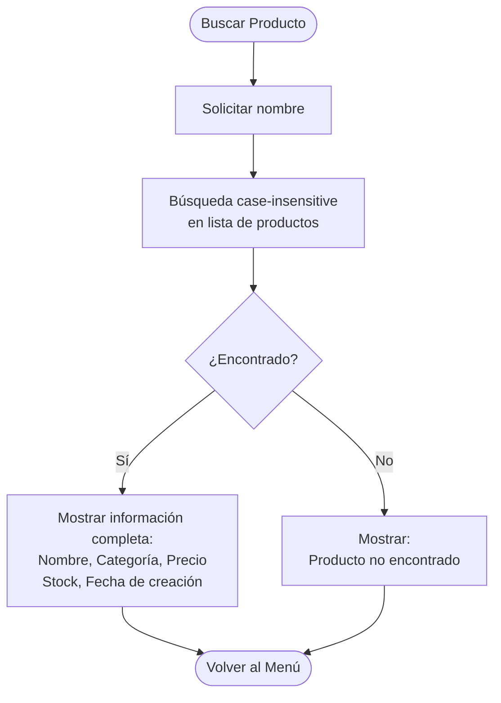
```mermaid
flowchart TD
    Start([Buscar Producto]) --> Input[Solicitar nombre]
    Input --> Search[Búsqueda case-insensitive<br/>en lista de productos]
    Search --> Found{¿Encontrado?}
    
    Found -->|Sí| Display[Mostrar información completa:<br/>Nombre, Categoría, Precio<br/>Stock, Fecha de creación]
    Display --> Return([Volver al Menú])
    
    Found -->|No| NotFound[Mostrar:<br/>Producto no encontrado]
    NotFound --> Return
```

### 5. Actualizar Cantidad

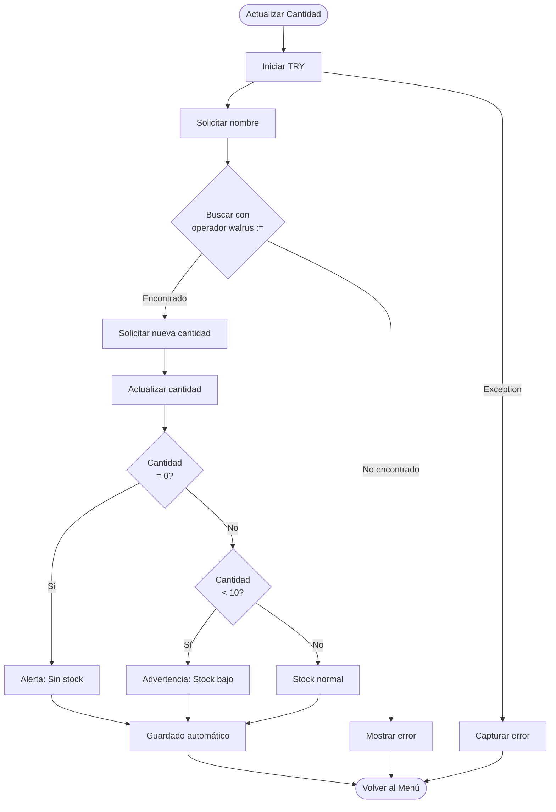
```mermaid
flowchart TD
    Start([Actualizar Cantidad]) --> TryStart[Iniciar TRY]
    TryStart --> Name[Solicitar nombre]
    Name --> Search{Buscar con<br/>operador walrus :=}
    
    Search -->|Encontrado| Qty[Solicitar nueva cantidad]
    Qty --> Update[Actualizar cantidad]
    Update --> CheckStock{Cantidad<br/>= 0?}
    
    CheckStock -->|Sí| Alert[Alerta: Sin stock]
    CheckStock -->|No| CheckLow{Cantidad<br/>< 10?}
    
    CheckLow -->|Sí| Warn[Advertencia: Stock bajo]
    CheckLow -->|No| OK[Stock normal]
    
    Alert --> AutoSave[Guardado automático]
    Warn --> AutoSave
    OK --> AutoSave
    AutoSave --> Return([Volver al Menú])
    
    Search -->|No encontrado| NotFound[Mostrar error]
    NotFound --> Return
    
    TryStart -->|Exception| Error[Capturar error]
    Error --> Return
```

### 6. Registrar Venta

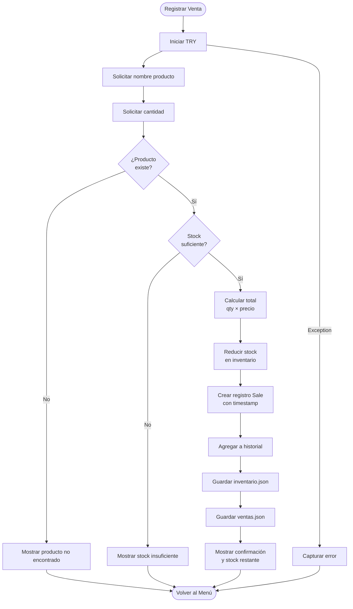
```mermaid
flowchart TD
    Start([Registrar Venta]) --> TryStart[Iniciar TRY]
    TryStart --> Name[Solicitar nombre producto]
    Name --> Qty[Solicitar cantidad]
    Qty --> Search{¿Producto<br/>existe?}
    
    Search -->|No| NotFound[Mostrar producto no encontrado]
    NotFound --> Return([Volver al Menú])
    
    Search -->|Sí| CheckStock{Stock<br/>suficiente?}
    
    CheckStock -->|No| NoStock[Mostrar stock insuficiente]
    NoStock --> Return
    
    CheckStock -->|Sí| CalcTotal[Calcular total<br/>qty × precio]
    CalcTotal --> UpdateStock[Reducir stock<br/>en inventario]
    UpdateStock --> CreateSale[Crear registro Sale<br/>con timestamp]
    CreateSale --> AddToHistory[Agregar a historial]
    AddToHistory --> AutoSave1[Guardar inventario.json]
    AutoSave1 --> AutoSave2[Guardar ventas.json]
    AutoSave2 --> ShowConfirm[Mostrar confirmación<br/>y stock restante]
    ShowConfirm --> Return
    
    TryStart -->|Exception| Error[Capturar error]
    Error --> Return
```

### 7. Flujo de Persistencia Automática

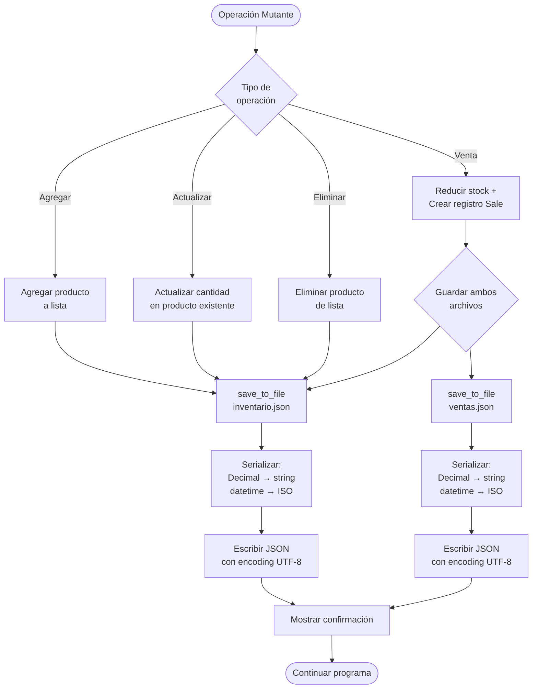
```mermaid
flowchart TD
    Start([Operación Mutante]) --> Check{Tipo de<br/>operación}
    
    Check -->|Agregar| Add[Agregar producto<br/>a lista]
    Check -->|Actualizar| Update[Actualizar cantidad<br/>en producto existente]
    Check -->|Eliminar| Delete[Eliminar producto<br/>de lista]
    Check -->|Venta| Sale[Reducir stock +<br/>Crear registro Sale]
    
    Add --> SaveInv[save_to_file<br/>inventario.json]
    Update --> SaveInv
    Delete --> SaveInv
    
    Sale --> SaveBoth{Guardar ambos<br/>archivos}
    SaveBoth --> SaveInv
    SaveBoth --> SaveSales[save_to_file<br/>ventas.json]
    
    SaveInv --> SerializeInv[Serializar:<br/>Decimal → string<br/>datetime → ISO]
    SaveSales --> SerializeSales[Serializar:<br/>Decimal → string<br/>datetime → ISO]
    
    SerializeInv --> WriteInv[Escribir JSON<br/>con encoding UTF-8]
    SerializeSales --> WriteSales[Escribir JSON<br/>con encoding UTF-8]
    
    WriteInv --> Confirm[Mostrar confirmación]
    WriteSales --> Confirm
    Confirm --> Return([Continuar programa])
```

### 8. Eliminar Producto

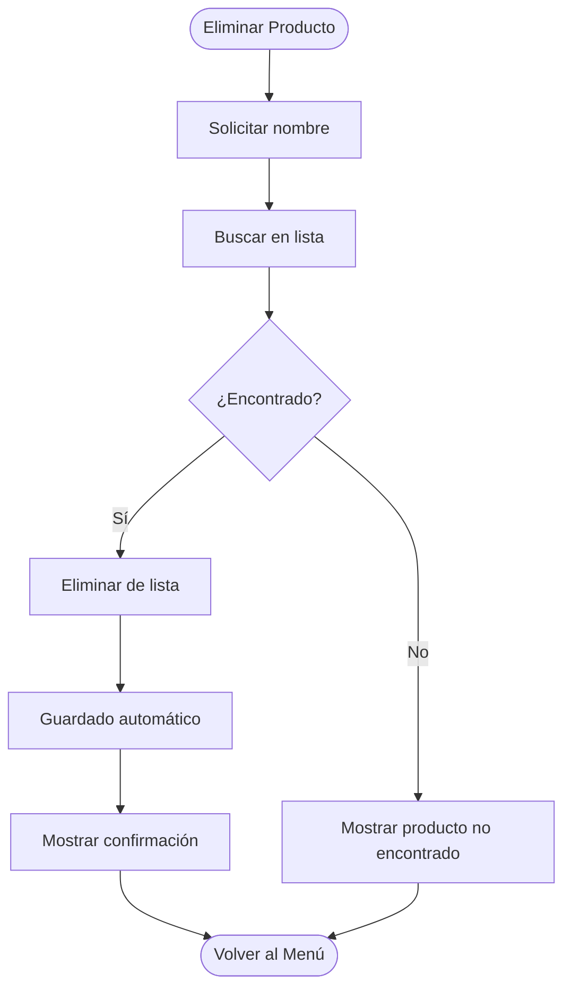
```mermaid
flowchart TD
    Start([Eliminar Producto]) --> Input[Solicitar nombre]
    Input --> Search[Buscar en lista]
    Search --> Found{¿Encontrado?}
    
    Found -->|Sí| Remove[Eliminar de lista]
    Remove --> AutoSave[Guardado automático]
    AutoSave --> Success[Mostrar confirmación]
    Success --> Return([Volver al Menú])
    
    Found -->|No| NotFound[Mostrar producto no encontrado]
    NotFound --> Return
```

### 9. Filtrar por Categoría

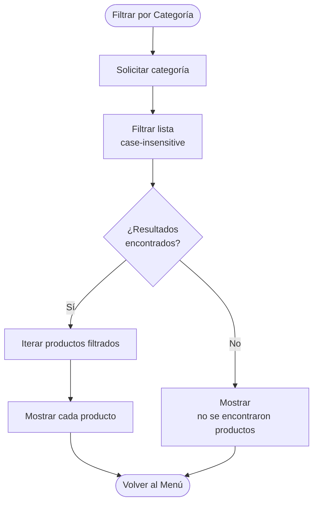
```mermaid
flowchart TD
    Start([Filtrar por Categoría]) --> Input[Solicitar categoría]
    Input --> Filter[Filtrar lista<br/>case-insensitive]
    Filter --> Check{¿Resultados<br/>encontrados?}
    
    Check -->|Sí| Loop[Iterar productos filtrados]
    Loop --> Display[Mostrar cada producto]
    Display --> Return([Volver al Menú])
    
    Check -->|No| Empty[Mostrar<br/>no se encontraron productos]
    Empty --> Return
```

### 10. Filtrar por Rango de Precio

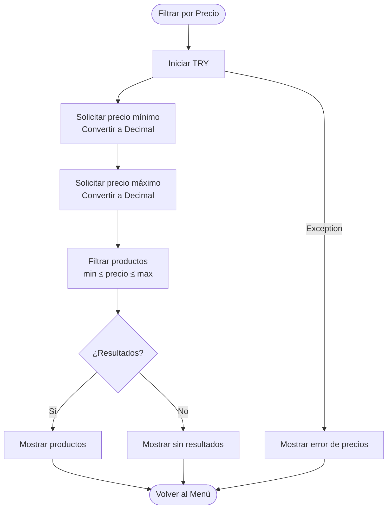
```mermaid
flowchart TD
    Start([Filtrar por Precio]) --> TryStart[Iniciar TRY]
    TryStart --> Min[Solicitar precio mínimo<br/>Convertir a Decimal]
    Min --> Max[Solicitar precio máximo<br/>Convertir a Decimal]
    Max --> Filter[Filtrar productos<br/>min ≤ precio ≤ max]
    Filter --> Check{¿Resultados?}
    
    Check -->|Sí| Display[Mostrar productos]
    Display --> Return([Volver al Menú])
    
    Check -->|No| Empty[Mostrar sin resultados]
    Empty --> Return
    
    TryStart -->|Exception| Error[Mostrar error de precios]
    Error --> Return
```

### 11. Verificar Estado del Stock

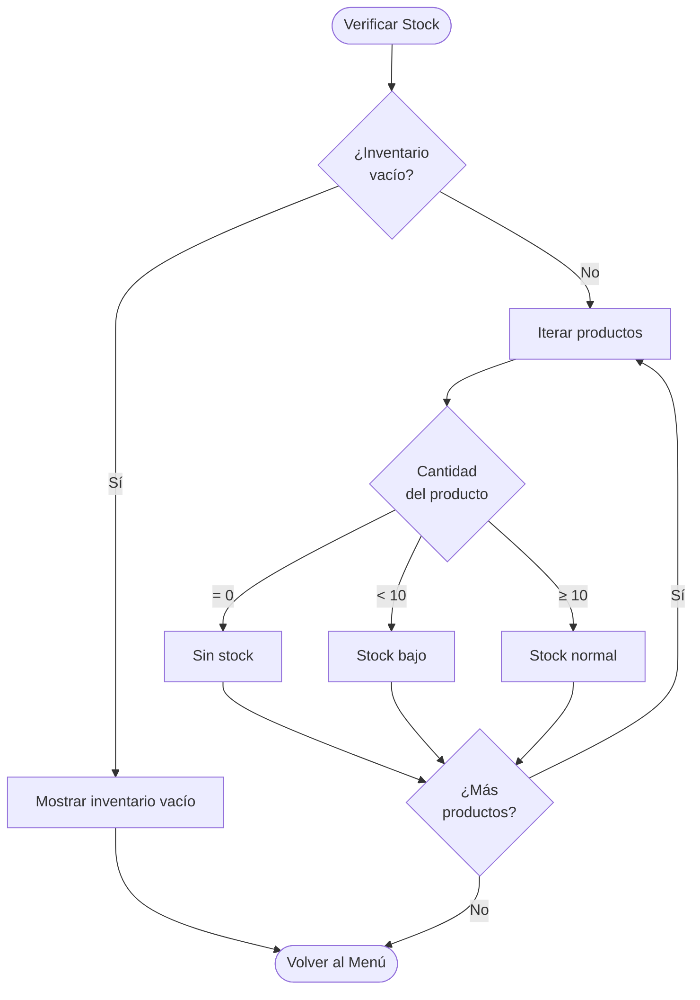
```mermaid
flowchart TD
    Start([Verificar Stock]) --> Check{¿Inventario<br/>vacío?}
    
    Check -->|Sí| Empty[Mostrar inventario vacío]
    Empty --> Return([Volver al Menú])
    
    Check -->|No| Loop[Iterar productos]
    Loop --> CheckQty{Cantidad<br/>del producto}
    
    CheckQty -->|= 0| ShowNone[Sin stock]
    CheckQty -->|< 10| ShowLow[Stock bajo]
    CheckQty -->|≥ 10| ShowOK[Stock normal]
    
    ShowNone --> More{¿Más<br/>productos?}
    ShowLow --> More
    ShowOK --> More
    
    More -->|Sí| Loop
    More -->|No| Return
```

### 12. Calcular Valor Total

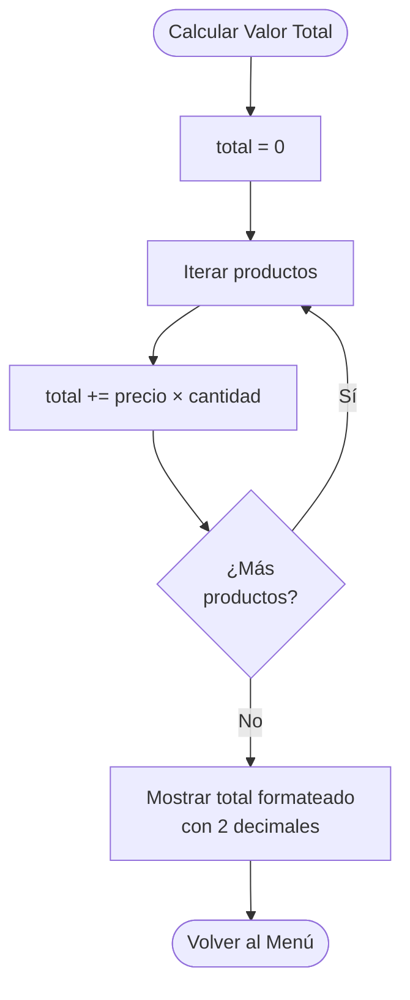
```mermaid
flowchart TD
    Start([Calcular Valor Total]) --> Init[total = 0]
    Init --> Loop[Iterar productos]
    Loop --> Calc[total += precio × cantidad]
    Calc --> More{¿Más<br/>productos?}
    
    More -->|Sí| Loop
    More -->|No| Display[Mostrar total formateado<br/>con 2 decimales]
    Display --> Return([Volver al Menú])
```

### 13. Productos Más Vendidos

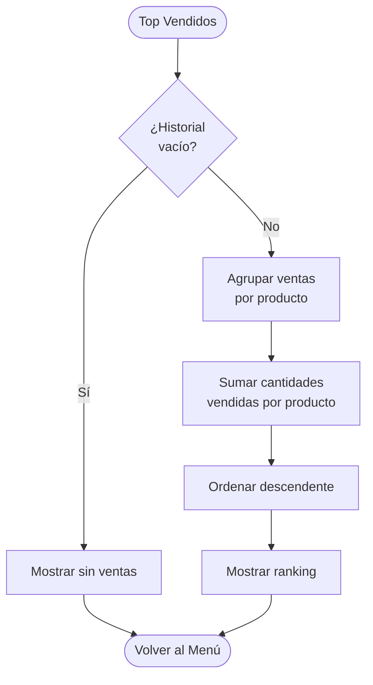
```mermaid
flowchart TD
    Start([Top Vendidos]) --> Check{¿Historial<br/>vacío?}
    
    Check -->|Sí| Empty[Mostrar sin ventas]
    Empty --> Return([Volver al Menú])
    
    Check -->|No| Group[Agrupar ventas<br/>por producto]
    Group --> Sum[Sumar cantidades<br/>vendidas por producto]
    Sum --> Sort[Ordenar descendente]
    Sort --> Display[Mostrar ranking]
    Display --> Return
```

### 14. Reporte de Ventas

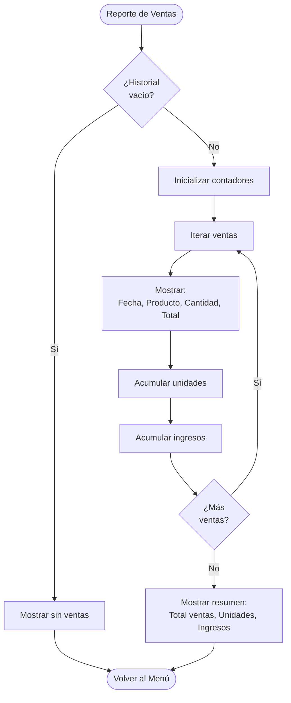
```mermaid
flowchart TD
    Start([Reporte de Ventas]) --> Check{¿Historial<br/>vacío?}
    
    Check -->|Sí| Empty[Mostrar sin ventas]
    Empty --> Return([Volver al Menú])
    
    Check -->|No| Init[Inicializar contadores]
    Init --> Loop[Iterar ventas]
    Loop --> Display[Mostrar:<br/>Fecha, Producto, Cantidad, Total]
    Display --> AccumQty[Acumular unidades]
    AccumQty --> AccumTotal[Acumular ingresos]
    AccumTotal --> More{¿Más<br/>ventas?}
    
    More -->|Sí| Loop
    More -->|No| Summary[Mostrar resumen:<br/>Total ventas, Unidades, Ingresos]
    Summary --> Return([Volver al Menú])
```

### 15. Gráfica ASCII de Inventario

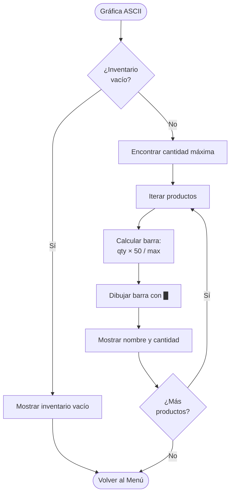
```mermaid
flowchart TD
    Start([Gráfica ASCII]) --> Check{¿Inventario<br/>vacío?}
    
    Check -->|Sí| Empty[Mostrar inventario vacío]
    Empty --> Return([Volver al Menú])
    
    Check -->|No| FindMax[Encontrar cantidad máxima]
    FindMax --> Loop[Iterar productos]
    Loop --> CalcBar[Calcular barra:<br/>qty × 50 / max]
    CalcBar --> DrawBar[Dibujar barra con █]
    DrawBar --> ShowQty[Mostrar nombre y cantidad]
    ShowQty --> More{¿Más<br/>productos?}
    
    More -->|Sí| Loop
    More -->|No| Return
```

### 16. Guardado Manual

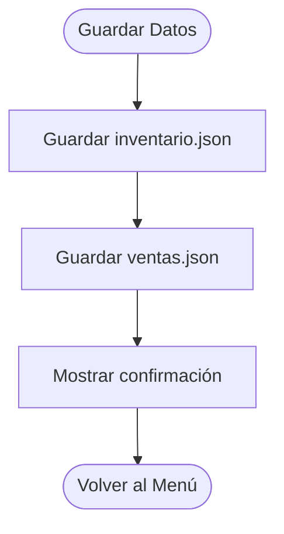
```mermaid
flowchart TD
    Start([Guardar Datos]) --> SaveInv[Guardar inventario.json]
    SaveInv --> SaveSales[Guardar ventas.json]
    SaveSales --> Confirm[Mostrar confirmación]
    Confirm --> Return([Volver al Menú])
```

### 17. Carga Manual

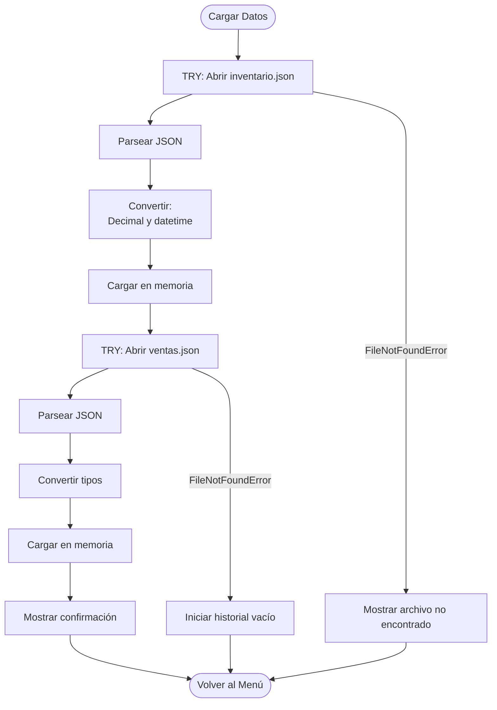
```mermaid
flowchart TD
    Start([Cargar Datos]) --> TryInv[TRY: Abrir inventario.json]
    TryInv --> ParseInv[Parsear JSON]
    ParseInv --> ConvertInv[Convertir:<br/>Decimal y datetime]
    ConvertInv --> LoadInv[Cargar en memoria]
    LoadInv --> TrySales[TRY: Abrir ventas.json]
    TrySales --> ParseSales[Parsear JSON]
    ParseSales --> ConvertSales[Convertir tipos]
    ConvertSales --> LoadSales[Cargar en memoria]
    LoadSales --> Success[Mostrar confirmación]
    Success --> Return([Volver al Menú])
    
    TryInv -->|FileNotFoundError| ErrorInv[Mostrar archivo no encontrado]
    ErrorInv --> Return
    
    TrySales -->|FileNotFoundError| ErrorSales[Iniciar historial vacío]
    ErrorSales --> Return
```

---

## Persistencia de Datos

### Formato JSON

#### inventario.json
```json
[
  {
    "name": "Laptop HP",
    "category": "Tecnologia",
    "price": "1500000",
    "quantity": 10,
    "created_at": "2025-10-31T14:05:43.754338"
  }
]
```

#### ventas.json
```json
[
  {
    "product_name": "Mouse Logitech",
    "quantity": 5,
    "unit_price": "85000",
    "total": "425000",
    "sale_date": "2025-10-31T14:07:43.184989"
  }
]
```

### Conversiones de Tipos

| Tipo Python | JSON | Conversión Load | Conversión Save |
|-------------|------|-----------------|-----------------|
| `Decimal` | `string` | `Decimal(str)` | `str(decimal)` |
| `datetime` | `string ISO` | `fromisoformat()` | `isoformat()` |
| `int` | `number` | Directo | Directo |
| `str` | `string` | Directo | Directo |

### Guardado Automático

El sistema guarda automáticamente después de:
- Agregar producto → `inv.save_to_file()`
- Actualizar cantidad → `inv.save_to_file()`
- Eliminar producto → `inv.save_to_file()`
- Registrar venta → `inv.save_to_file()` + `sales.save_to_file()`

### Carga Automática

Al iniciar `main()`:
```python
inv.load_from_file("inventario.json")
sales.load_from_file("ventas.json")
```

---

## 📚 Ejemplos de Uso

### Ejemplo 1: Agregar y Listar Productos

```
=== SUBMENÚ: Productos ===
1. Agregar producto

Nombre: Teclado Mecánico
Categoría: Accesorios
Precio: 250000
Cantidad: 15
Producto agregado: Teclado Mecánico
Inventario guardado en inventario.json

---

2. Listar productos

Teclado Mecánico | Accesorios | $250000 | Stock: 15 | Añadido: 31/10/2025 14:07:43
```

### Ejemplo 2: Registrar Venta

```
=== SUBMENÚ: Ventas y Reportes ===
10. Registrar venta

Nombre del producto: Mouse Logitech
Cantidad a vender: 5

Venta registrada: 5 unidades de Mouse Logitech
Total: $425000
Stock restante: 20
Inventario guardado en inventario.json
Historial de ventas guardado en ventas.json
```

### Ejemplo 3: Verificar Stock Bajo

```
8. Verificar estado del stock

=== ESTADO DEL STOCK ===
Teclado Mecánico: 0 unidades (SIN STOCK)
Mouse USB: 8 unidades (STOCK BAJO)
Monitor 24": 25 unidades (STOCK NORMAL)
```

### Ejemplo 4: Gráfica de Inventario

```
13. Gráfica de inventario

=== GRÁFICA DE INVENTARIO ===
Laptop HP       ████████████████████ (20)
Mouse Logitech  ██████████████████████████████ (30)
Teclado         ████████ (8)
```

---

## Tecnologías

### Biblioteca Estándar de Python

| Módulo | Uso |
|--------|-----|
| `decimal.Decimal` | Precisión monetaria sin errores de redondeo |
| `datetime` | Timestamps de creación y ventas |
| `dataclasses` | Modelos limpios (Product, Sale) |
| `json` | Serialización y persistencia |

### Patrones y Técnicas

- **Walrus Operator (`:=`)**: Asignación en condicionales
- **List Comprehension**: Filtrado eficiente
- **Try/Except**: Manejo robusto de errores
- **Format Strings (f-strings)**: Salida formateada
- **Dataclasses**: Reducción de boilerplate
- **Context Managers (`with`)**: Manejo seguro de archivos

---


## Recursos de Aprendizaje

### Conceptos Aprendidos en este Proyecto

**Estructuras de Control**
- `if/elif/else` para menús
- `for` loops para iteración
- `while` loops para menús persistentes

**Manejo de Errores**
- `try/except` para validación
- Excepciones específicas (`FileNotFoundError`, `JSONDecodeError`)

**Programación Orientada a Objetos**
- Clases y métodos
- Dataclasses
- Encapsulación

**Persistencia de Datos**
- Serialización JSON
- Conversión de tipos
- Manejo de archivos

**Tipos de Datos Avanzados**
- `Decimal` para precisión monetaria
- `datetime` para timestamps
- Listas y diccionarios

